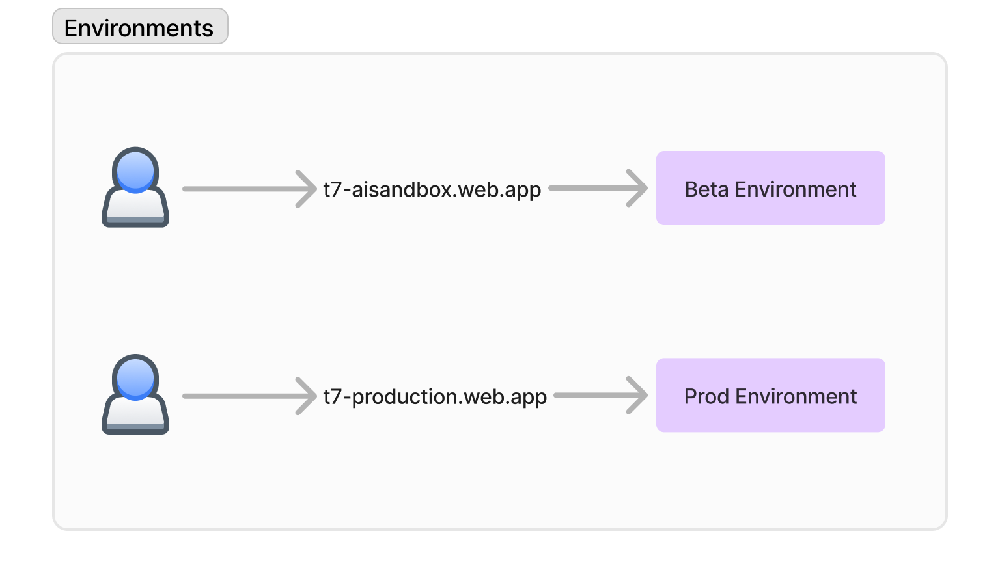
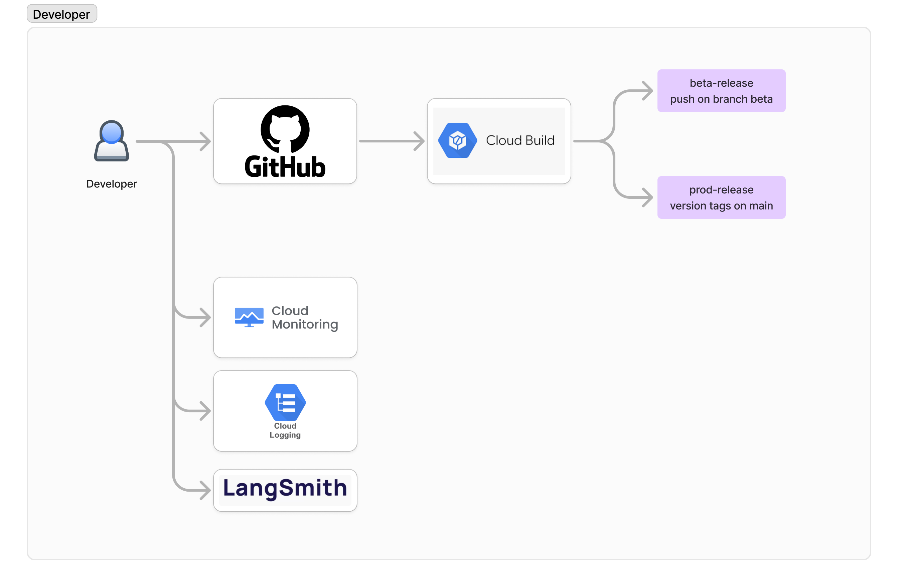
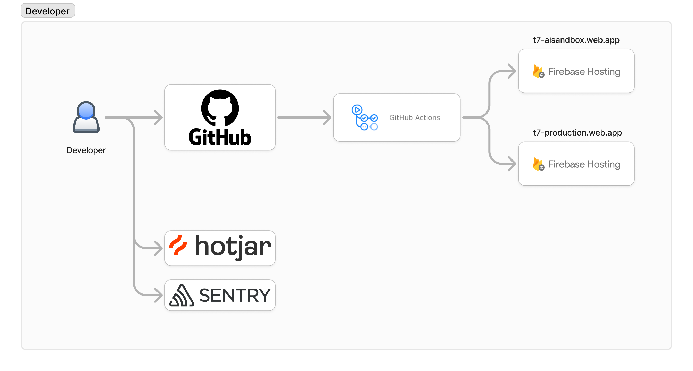

## Enrivonments



## Backend deployment

Backend Deployment Using Google Cloud Build and Google Cloud Run



### Prerequisites

Before you begin, ensure you have the following prerequisites:

1. **Google Cloud Project**: A Google Cloud project with billing enabled.
2. **Google Cloud SDK**: Installed and configured on your local machine.
3. **Docker**: Installed on your local machine for building and testing Docker images.
4. **Source Code**: Your backend service source code stored in a version control system (e.g., GitHub, GitLab, Bitbucket).
5. **IAM Permissions**: Ensure you have the necessary IAM permissions to create and manage Cloud Build triggers, Cloud Run services, and other associated resources.

### Steps to Deploy

#### 1. Configure Google Cloud SDK

Authenticate and configure the Google Cloud SDK with your Google Cloud project:

```sh
gcloud auth login
gcloud config set project YOUR_PROJECT_ID
```

#### 2. Dockerfile

A `Dockerfile` for backend service. This file contains instructions to build your Docker image. Below is an example for a Node.js application:

[https://github.com/TsevenSG/sails-backend/blob/beta/deployments/external.Dockerfile](https://github.com/TsevenSG/sails-backend/blob/beta/deployments/external.Dockerfile)

#### 3. Create Cloud Build Configuration

`cloudbuild.yaml` file for backend service repository. This file defines the steps to build your Docker image and deploy it to Google Cloud Run:

[https://github.com/TsevenSG/sails-backend/blob/beta/deployments/external-beta.cloudbuild.yaml](https://github.com/TsevenSG/sails-backend/blob/beta/deployments/external-beta.cloudbuild.yaml)

#### 4. Create a Cloud Build Trigger

Create a Cloud Build trigger to automatically build and deploy your service when changes are pushed to your repository.

#### 5. Test the Deployment

Push changes to the specified branch in your repository to trigger the build and deployment process. You can monitor the build progress in the Google Cloud Console under **Cloud Build**.

#### 6. Access the Deployed Service

Once the deployment is complete, you can access your backend service using the URL provided by Google Cloud Run. This URL can be found in the Cloud Run service details in the Google Cloud Console.

Write a full detailed document for a developer to understand the system.

## Frontend Deployment

Frontend deployment using Firebase Hosting and Github Actions



### Prerequisites

Before you begin, ensure you have the following:

1. **Firebase CLI**: Install Firebase CLI globally using npm.
    ```sh
    npm install -g firebase-tools
    ```
2. **Firebase Project**: A Firebase project set up in the Firebase Console.
3. **GitHub Repository**: Your frontend code should be hosted in a GitHub repository.
4. **GitHub Actions**: Basic understanding of GitHub Actions.

### Steps

#### 1. Firebase Setup

##### 1.1 Initialize Firebase in Your Project

1. Navigate to your project directory.
2. Initialize Firebase using the CLI.
    ```sh
    firebase init
    ```
3. Select **Hosting** from the list of Firebase features.
4. Choose the Firebase project you want to associate with this directory.
5. Specify the public directory (usually `build` or `dist`).
6. Configure as a single-page app if applicable.

##### 1.2 Deploy Manually (Optional)

To ensure everything is set up correctly, you can deploy manually the first time.

```sh
firebase deploy
```

#### 2. GitHub Actions Setup

##### 2.1 Create a Firebase Token

Generate a Firebase token to authenticate deployments from GitHub Actions.

```sh
firebase login:ci
```

This command will provide you with a token. Save this token as a GitHub secret.

##### 2.2 Add Firebase Token to GitHub Secrets

1. Go to your GitHub repository.
2. Navigate to **Settings** > **Secrets** > **Actions**.
3. Add a new secret named `FIREBASE_TOKEN` and paste the token you generated.

##### 2.3 Create GitHub Actions Workflow

Create a workflow configuration file in your repository. Typically, this file is located at `.github/workflows/deploy.yml`.

```yaml
name: Deploy to Firebase Hosting

on:
    push:
        branches:
            - main # Adjust this to the branch you want to deploy from

jobs:
    build_and_deploy:
        runs-on: ubuntu-latest

        steps:
            - name: Checkout Repository
              uses: actions/checkout@v2

            - name: Set up Node.js
              uses: actions/setup-node@v2
              with:
                  node-version: '14' # Use the Node.js version your project requires

            - name: Install Dependencies
              run: npm install

            - name: Build Project
              run: npm run build # Adjust this if your build command is different

            - name: Deploy to Firebase
              env:
                  FIREBASE_TOKEN: ${{ secrets.FIREBASE_TOKEN }}
              run: firebase deploy --only hosting
```

#### 3. Testing the Deployment

1. Commit and push your changes to the repository.
2. GitHub Actions will automatically trigger the workflow.
3. Monitor the workflow in the **Actions** tab of your GitHub repository.
4. Verify the deployment by visiting your Firebase Hosting URL.
